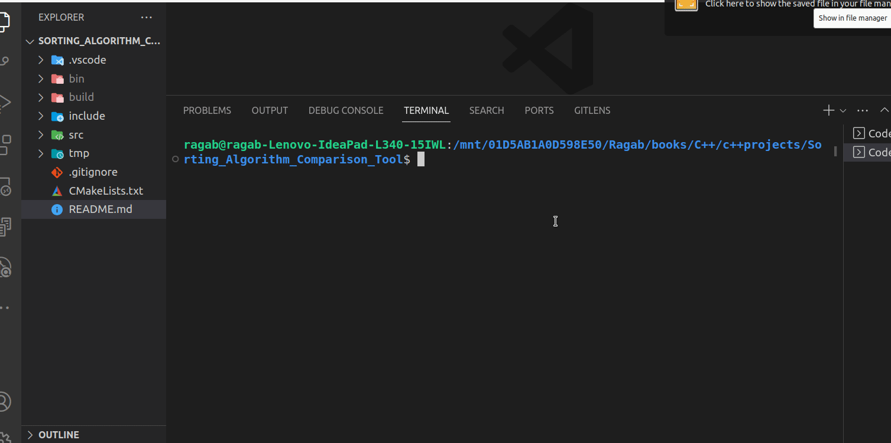

# Sorting Algorithm Comparison Tool

<!--
-->
<kbd></kbd>

The **Sorting Algorithm Comparison Tool**  is a C++ project designed to compare the performance of various sorting algorithms. This tool generates random sets of integers, applies different sorting algorithms to these sets, measures the time it takes to sort the data, and provides a summary of the sorting times. It's an educational tool that helps users understand the efficiency and differences between sorting algorithms.

## Description

Sorting algorithms are a fundamental concept in computer science and play a crucial role in data processing and analysis. This project aims to provide a practical and visual way to explore different sorting algorithms and observe their execution times when sorting data sets.

The tool includes eight sorting algorithms, including Selection Sort, Bubble Sort, Insertion Sort, Merge Sort, Quick Sort, Heap Sort, Counting Sort, and Radix Sort. Users can select one or more algorithms to apply to random data sets, and the tool measures and displays the time it takes for each algorithm to complete the sorting process.

## Technology

The Sorting Algorithm Comparison Tool is developed using C++ and leverages a variety of C++ features and libraries for its functionality. Here's an overview of the key components and technologies used in this project:

- **C++ Language:** The project is primarily written in C++, a powerful and versatile programming language.
- **C++ Standard Library:** Standard C++ libraries are used for data structures, algorithms, and I/O operations.
- **Chrono Library:** The Chrono library is utilized for measuring execution times with high precision.
- **Object-Oriented Programming:** The project employs object-oriented programming principles to create modular and extensible code.
- **Command Line Interface (CLI):** User interaction is through the command line, making it easy to use and understand.
- **Random Number Generation:** Random sets of integers are generated to test the sorting algorithms.
- **Sorting Algorithms:** Eight well-known sorting algorithms are implemented within the project.

## Getting Started
Follow the steps below to use and build the project:

1. Clone the repository:
   ```sh
   git clone https://github.com/Ragab2010/Sorting_Algorithm_Comparison_Tool.git
   ```

2. Build the project using CMake:
   ```sh
   mkdir build
   cd build
   cmake ..
   make
   ```

3. Run the executable:
   - For compression:
     ```sh
     ./bin/SortAlgorithmCompTool
     ```

   - For decompression:
     ```sh
     ./bin/SortAlgorithmCompTool
     ```

## Usage

To use the Sorting Algorithm Comparison Tool:

1. Clone the project repository to your local machine.

2. Compile the source code using a C++ compiler, such as g++.

3. Run the compiled executable.

4. Follow the on-screen instructions to set parameters for data generation and select sorting algorithms.

5. Observe the sorted data sets and the summary of execution times.

## Available Sorting Algorithms

The project includes the following sorting algorithms for comparison:

- Selection Sort
- Bubble Sort
- Insertion Sort
- Merge Sort
- Quick Sort
- Heap Sort
- Counting Sort
- Radix Sort

Each algorithm can be selected and tested individually or in combination with others.
